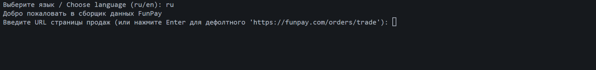
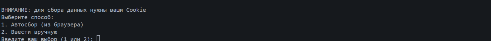
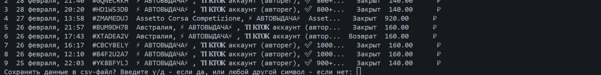
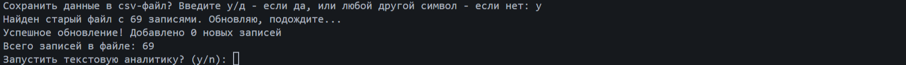
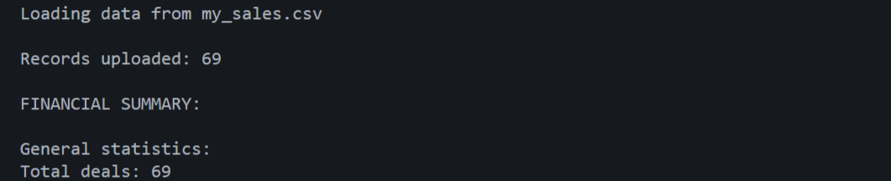
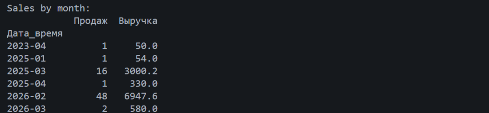
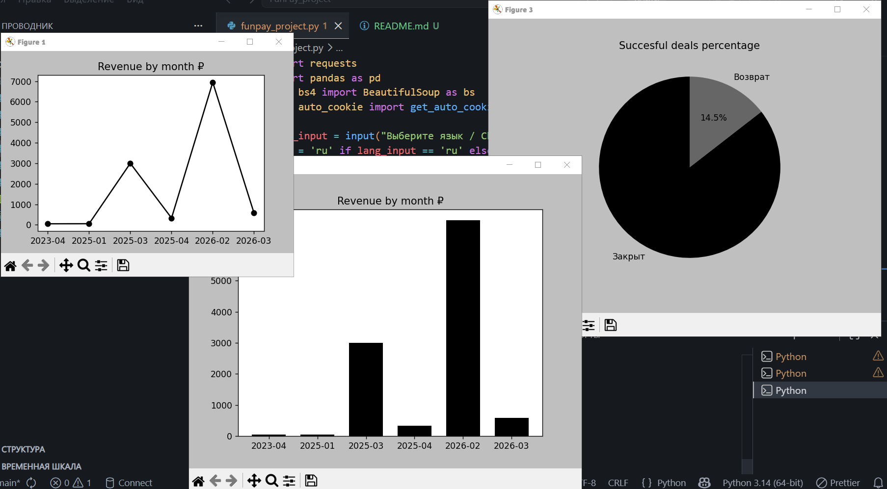

[🇺 Читать на русском](README_RU.md) | [🇬🇧 Read in English](README.md)

# FunPay Analytics Script

Python-скрипт для автоматического сбора, структурирования и анализа продаж на маркетплейсе FunPay. 

Решает проблему отсутствия встроенной наглядной аналитики на платформе, помогая продавцам превращать сырые данные о сделках в понятные финансовые отчеты и графики.

## Основные возможности

- **Автосбор Cookie**: автоматическое получение сессии из браузера без ручного копирования.
- **Умное обновление CSV**: добавляет только новые продажи, игнорируя дубликаты по номеру заказа.
- **Локализация**: поддержка русского и английского языков в интерфейсе.
- **Текстовая аналитика**: автоматический подсчет выручки, среднего чека, процента возвратов и продаж по периодам.
- **Визуализация**: построение наглядных графиков (динамика выручки, распределение статусов сделок).

## Технологический стек

Проект написан на **Python** с использованием объектно-ориентированного и процедурного подходов (функции, циклы). 

**Использованные библиотеки:**
- `Pandas` — обработка, очистка и анализ табличных данных.
- `BeautifulSoup4` и `requests` — парсинг HTML-страниц и работа с HTTP-запросами.
- `browser_cookie3` — безопасный извлечение Cookie из браузеров.
- `matplotlib` — построение графиков и диаграмм.
- `dateparser` — интеллектуальный парсинг дат на русском языке.

## Установка и запуск

*(Раздел будет дополнен после упаковки скрипта в .exe файл для удобного запуска пользователями без установки Python).*

## Примеры работы

### Работа со скриптом

*Рисунок 1: Выбор языка для работы со скриптом*

*Рисунок 2: Опция сбора куки (авто-режим или вручную)*

*Рисунок 3: Опция сохранения данных в удобную таблицу в csv формате*

### Вывод аналитики

*Рисунок 4: Опция выбора о проведении аналитики по готовым данным*

*Рисунок 5: Аналитика по выведенным данным*

*Рисунок 6: Аналитика по месяцам и дням недели из выведенных данных*

### Графики

*Рисунок 7: Показ графиков и диаграммы по показателям*